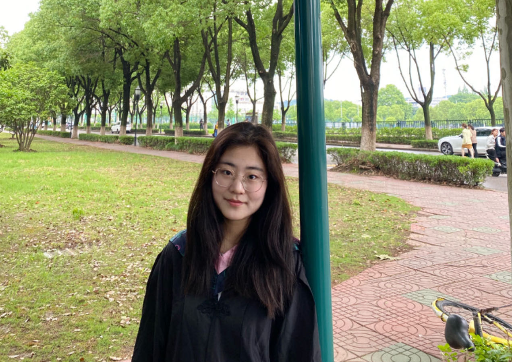
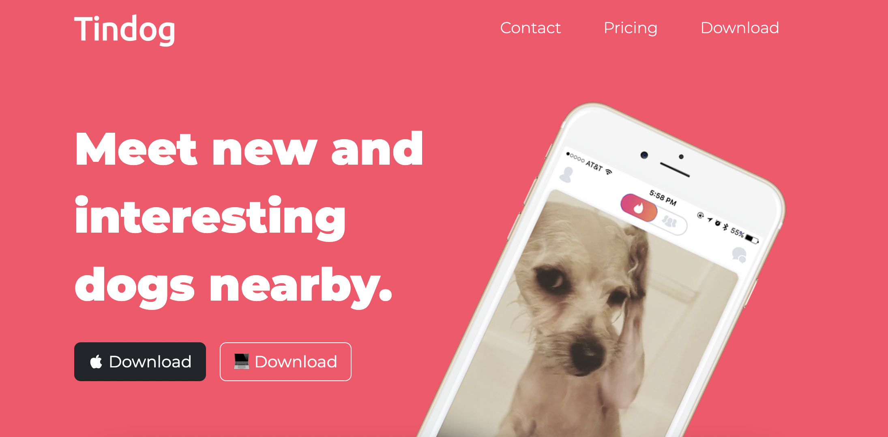
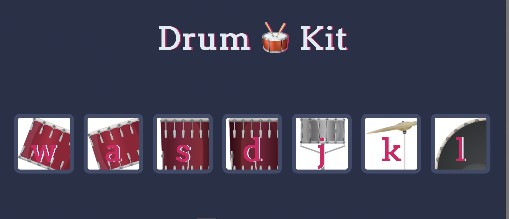
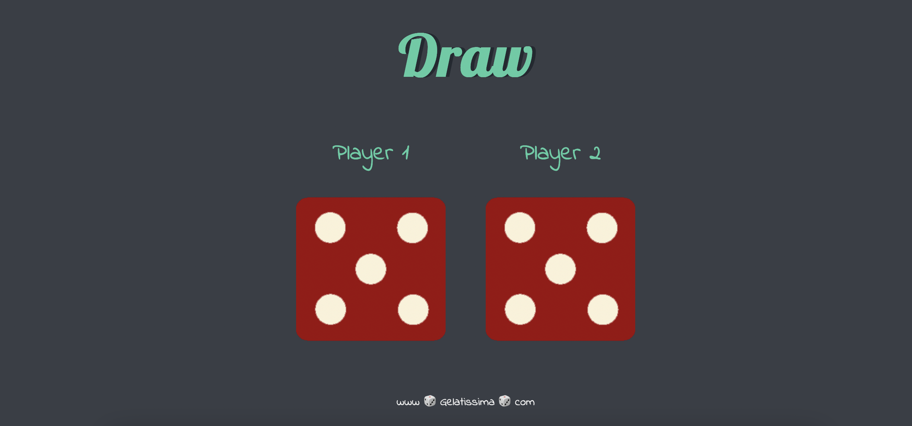
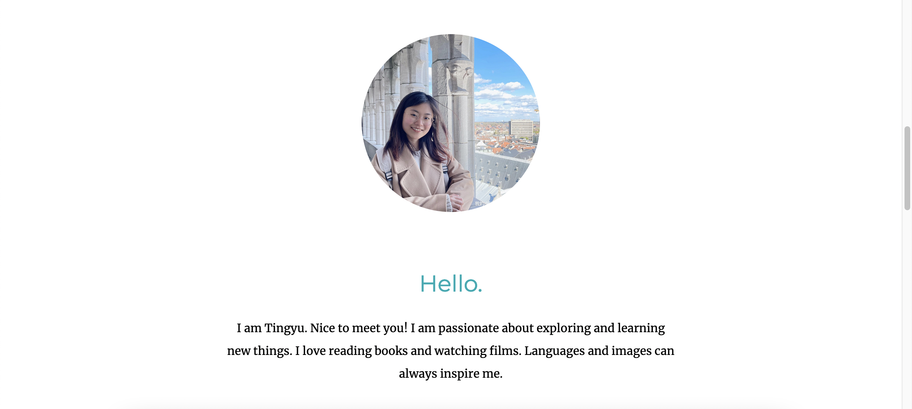

> Hi there!
>
> Welcome to Tingyu's studying docsite.
>

- 在这里我分享了和数据分析，代码学习相关的项目报告以及一些其他想要share的知识
- 更多好玩的东西还在持续更新中，有任何想要分享的想法，好玩的东西请邮件联系我：gelatissima@yahoo.com
- 来认识我吧！🥳

As a language learner-- I speak Chinese, English and Italian-- I am passionate with great imagination towards life.  
I love communicating in both languages and codes, which makes thoughts💬 sparkling in two important dimensions.  
As an imperfect perfectionist, I am meticulous, patient, logic- and solution- oriented at work. Also, I am a friendly and easy-going person with sense of humor.  

♥️ I am happy you come here and have fun at my website!

Recent programming works
-----------

-----------
### Tindog
Tindog is a pure frontend project displaying a well-designed and creative webpage with CSS and Bootstrap.

https://begal2.github.io/Tinder-Dog/

### Drumkit
Click the drumkit and listen

https://begal2.github.io/DrumKit/

### Dicee Game
Refresh the page and see who wins!

https://begal2.github.io/Dicee-game/

### Profile
A very first attempt; Completely static webpage using HTML and CSS

https://begal2.github.io/personal-website/

------------

<em>More interesting projects are coming!</em>

Get In Touch
------------

Do not hesitate to email me if you are interested in me.  
🤩 Looking forward to having a fantastic conversation with you.
Mail me at: gelatissima@yahoo.com
