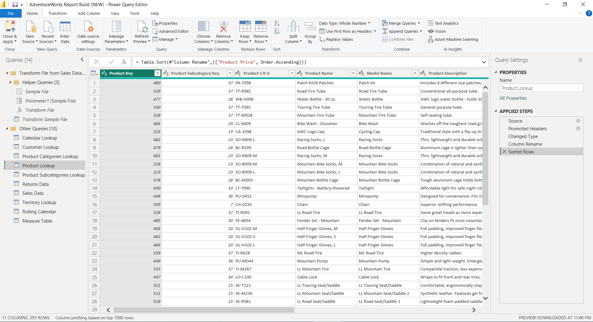
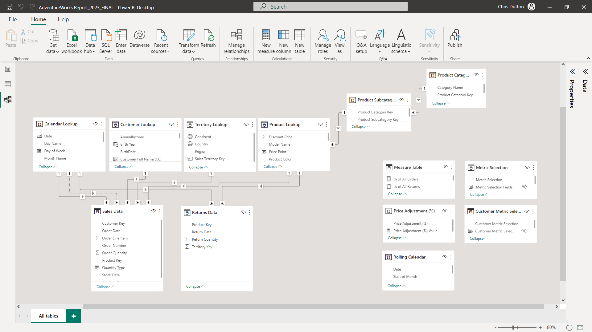
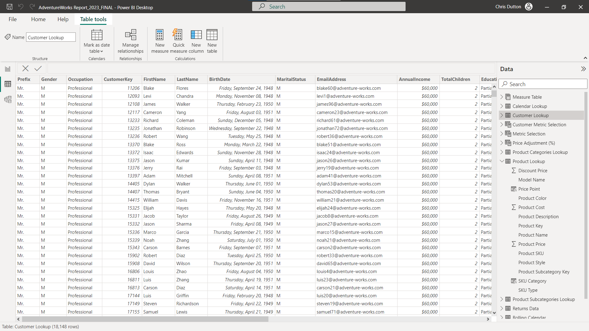
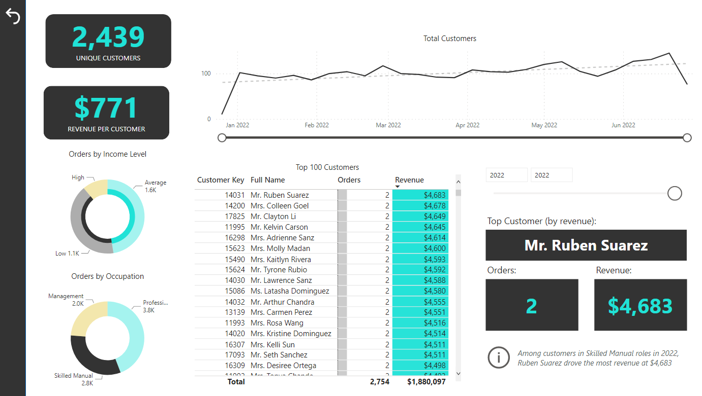
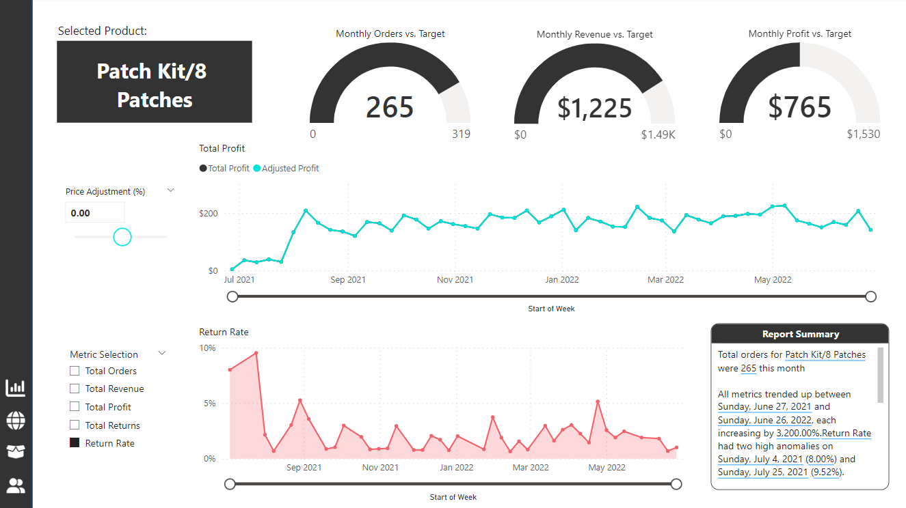
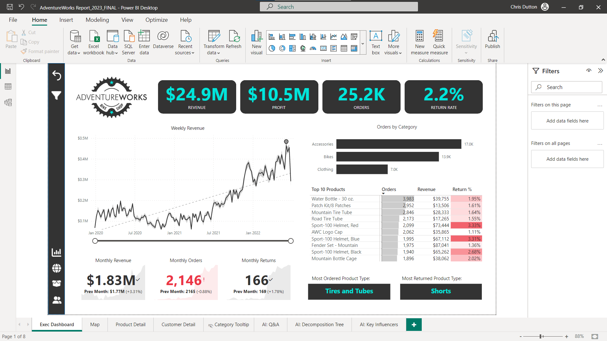
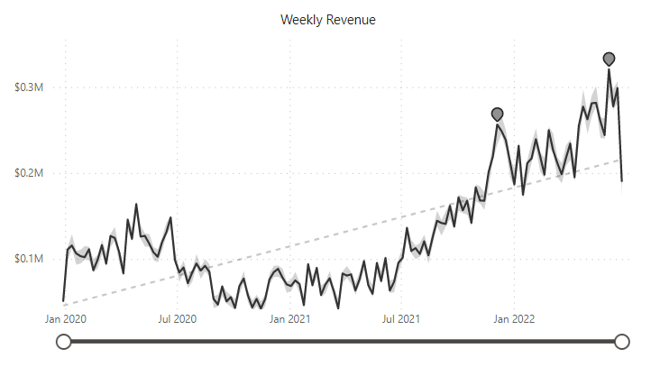

# Adventure Works Bicycle Retailer Power BI Data Visualization Report
# Adventure Works 自行车零售商 Power BI 数据可视化报告

**Project Description:**
In this project, I actively participated in the creation of a data visualization report for Adventure Works, a bicycle retail business. Through a series of detailed steps and techniques, I presented an overview of the company's business performance and forecasted future revenue trends. The key tasks I undertook in the project include:

**项目描述：** 在这个项目中，我深入参与了 Adventure Works 自行车零售商的数据可视化报告创建过程，通过一系列详细的步骤和技术，呈现了公司业务状况并对未来收益趋势进行了预测。以下是我在项目中所做的主要工作：

**Data Cleaning and Preprocessing:**

- Conducted detailed data cleaning on the raw dataset, which involved standardizing the capitalization of customer names.
- Introduced additional time dimensions such as months, quarters, and weeks to enhance temporal analysis.
- Adjusted data types as necessary to ensure uniformity and accuracy throughout the dataset.

**数据清洗和预处理：**

- 对原始数据进行了详细的数据清洗，包括标准化客户姓名的大小写、添加月份、季度和星期等时间维度列，并根据需要更改了数据类型，确保数据的一致性和准确性。

**Data Modeling and Table Relationships:**

- Leveraged Power BI's data modeling capabilities to establish appropriate relationships between various tables within the source data.
- This facilitated the seamless connection of different data elements in the report, enabling in-depth analysis and insights.

**数据建模和表关系：**

- 利用 Power BI 的数据建模功能，我为源数据中的各个表单建立了合适的表关系。这有助于在报告中将不同数据元素连接起来，从而实现深入分析。

**Calculating Metrics and Measures:**

- Developed a series of calculated fields and measures, including but not limited to order quantity, profit, revenue, and return rates, based on business requirements.
- These calculations were designed to enable in-depth analysis of sales and business performance within the report.

**计算指标和度量：**

- 我根据业务需求，编写了一系列的计算字段和度量，如订单数量、利润、收益和退货率等，以便能够深入分析销售和业务情况。

**Multidimensional Visualization Design:**

- Aligned with business objectives, I crafted various types of visualization charts, such as line charts, bar charts, pie charts, etc.
- These visualizations were strategically chosen to represent the company's revenue performance from macro, geographical, product, and customer perspectives.

**多维度可视化设计：**

- 基于业务目标，我设计了多个不同类型的可视化图表，包括折线图、条形图、扇形图等，分别从宏观、地理、产品和客户四个维度展示了公司的营业收益情况。
- 客户维度 Customer Dimension

- 产品类别维度 Product Type Dimension

**Dynamic Dashboard Construction:**

- Leveraged Power BI's dashboard functionality to construct an interactive dashboard.
- This dynamic dashboard enables users to freely select data slices and filtering conditions, facilitating a deeper understanding of the data based on individual needs.

**动态仪表板构建：**

- 利用 Power BI 的仪表板功能，我创建了一个交互式的仪表板，使用户可以根据需要自由选择数据切片和筛选条件，从而更深入地了解数据。

**Trend Forecasting and Analysis:**

- Utilizing historical data, conducted forecasting and analysis of revenue trends.
- Provided management with insights into future business directions based on the forecasted trends.

**趋势预测和分析：**

- 基于历史数据，我进行了收益趋势的预测和分析，为管理层提供了关于未来业务走向的洞察。

**Project Achievements and Benefits:**

- Enhanced data quality and accuracy through data cleaning and preprocessing, adding practical value to subsequent analyses.
- Optimization of data modeling and table relationships strengthened data correlations, enabling more in-depth analytical insights.
- The creation of calculated fields and measures provided the report with rich business metrics, offering comprehensive insights for management.
- Multidimensional visualization design allowed for the presentation of data stories at different levels, providing holistic support for decision-making.
- Construction of a dynamic dashboard improved user experience, allowing personalized data exploration based on user needs.
- Trend forecasting and analysis empowered management to make proactive strategic and business decisions.

**项目成果和效益：**

- 通过数据清洗和预处理，提高了数据质量和准确性，使得后续分析更具有实际价值。
- 数据建模和表关系的优化，加强了数据之间的关联性，支持了更深入的洞察分析。
- 编写的计算字段和度量，为报告提供了丰富的业务指标，使管理层能够更全面地了解业务情况。
- 多维度的可视化设计，使不同层面的数据故事得以呈现，为决策提供了更全面的支持。
- 动态仪表板的构建，提升了用户体验，使报告能够根据用户需求进行个性化的数据探索。
- 趋势预测和分析，使管理层能够更具前瞻性地制定战略和业务决策。
