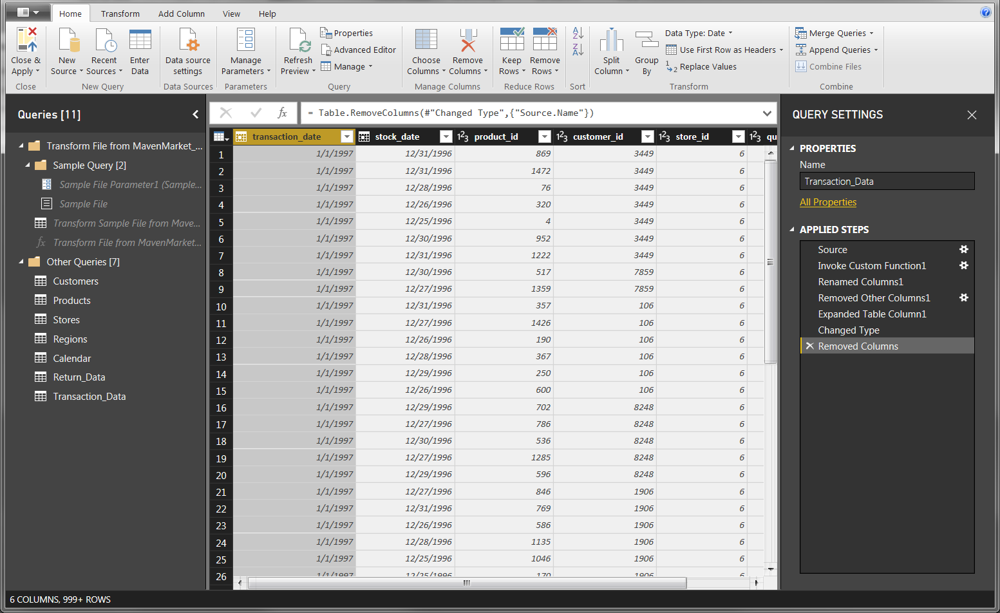
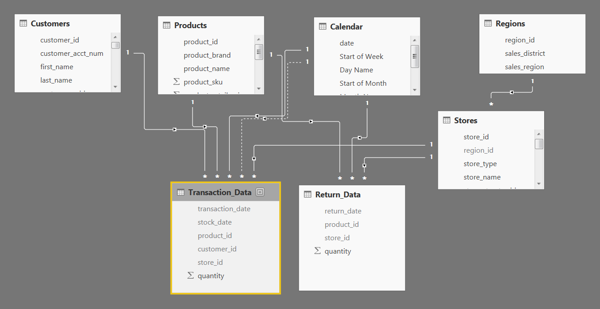
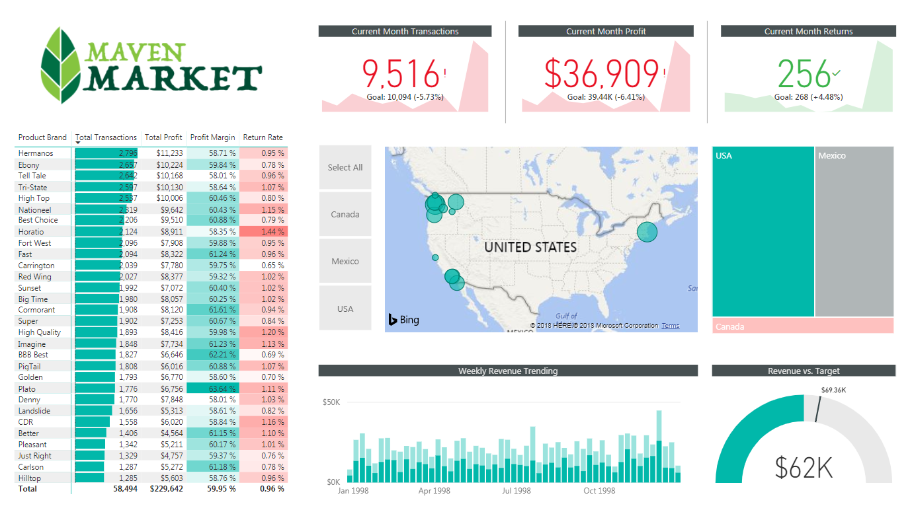

# Introduction

Looking for another chance to put your Power BI skills to work? You're in luck!

This time you'll be working with data from  **Maven Market** , a multi-national grocery chain with locations in Canada, Mexico and the United States.

Just like the AdventureWorks project, you'll work through the entire business intelligence workflow:  **connecting and shaping the data, building a relational model, adding calculated fields, ** and ** designing an interactive report**.

I've attached all of the files you'll need to get started, including:

- **Maven\_Market.png** _ (Maven Market logo)_
- **Maven Market CSV Files.zip**  _(zipped folder containing the CSV files you'll need to build your report)_
- **Maven\_Market\_Report\_COMPLETE.zip** _ (completed report, for reference if you get stuck)_

When you're ready to dig in, continue on to  **PART 1: Connecting & Shaping the Data ** for more instructions.

Good luck!

此讲座的资源

_来自__\<_[https://www.udemy.com/course/microsoft-power-bi-up-running-with-power-bi-desktop/learn/lecture/9493748#overview](https://www.udemy.com/course/microsoft-power-bi-up-running-with-power-bi-desktop/learn/lecture/9493748#overview)_\>_

# PART 1: Connecting & Shaping the Data

_ **Open a new Power BI Desktop file, and complete the following steps:** _

**1)** Update your Power BI options and settings as follows:

- Deselect the "_Autodetect new relationships after data is loaded_" option in the **Data Load**  tab
- Make sure that Locale for import is set to "_English (United States)_" in the **Regional Settings** tab

**2)** Connect to the  **MavenMarket\_Customers** csv file

- Name the table " **Customers**", and make sure that headers have been promoted
- Confirm that data types are accurate ( **Note:**"_customer\_id_" should be whole numbers, and both "_customer\_acct\_num_" and "_customer\_postal\_code_" should be text)
- Add a new column named "_full\_name" _to merge the the "_first\_name"_ and "_last\_name"_ columns, separated by a space
- Create a new column named "_birth\_year" _to extract the year from the "_birthdate" _column, and format as text
- Create a  **conditional column ** named "_has\_children" _which equals " **N**" if "_total\_children"_ = 0, otherwise " **Y**"

**3)** Connect to the **MavenMarket\_Products** csv file

- Name the table " **Products**" and make sure that headers have been promoted
- Confirm that data types are accurate ( **Note:**  "_product\_id_" should be whole numbers, "_product\_sku_" should be text), "_product\_retail\_price_" and "_product\_cost_" should be decimal numbers)
- Use the statistics tools to return the number of distinct product brands, followed by distinct product names

  - _ **Spot check:** _ _You should see_ _ **111** _ _brands and_ _ **1,560** _ _product names_

- Add a calculated column named "_discount\_price_", equal to 90% of the original retail price

  - Format as a fixed decimal number, and then use the rounding tool to round to 2 digits

- Select "_product\_brand_" and use the **Group By** option to calculate the average retail price by brand, and name the new column "_Avg Retail Price_"
  - _ **Spot check: ** __You should see an average retail price of_ _ **$2.18** _ _for Washington products, and_ _ **$2.21 **__ for Green Ribbon_
- Delete the last applied step to return the table to its pre-grouped state
- Replace "_null_" values with zeros in both the "_recyclable_" and "_low-fat_" columns

**4)** Connect to the  **MavenMarket\_Stores**  csv file

- Name the table " **Stores**" and make sure that headers have been promoted
- Confirm that data types are accurate ( **Note:**  "_store\_id_" and "_region\_id_" should be whole numbers)
- Add a calculated column named "_full\_address_", by merging "_store\_city_", "_store\_state_", and "_store\_country_", separated by a comma and space (_ **hint:** _ _use a custom separator_)
- Add a calculated column named "_area\_code_", by extracting the characters before the dash ("-") in the "_store\_phone_" field

**5)** Connect to the **MavenMarket\_Regions** csv file

- Name the table " **Regions**" and make sure that headers have been promoted
- Confirm that data types are accurate ( **Note:**  "_region\_id_" should be whole numbers)

**6)** Connect to the **MavenMarket\_Calendar** csv file

- Name the table " **Calendar**" and make sure that headers have been promoted
- Use the date tools in the query editor to add the following columns:

  - _Start of Week (starting Sunday_
  - _Name of Day_
  - _Start of Month_
  - _Name of Month_
  - _Quarter of Year_
  - _Year_

**7)** Connect to the **MavenMarket\_Returns** csv file

- Name the table " **Return\_Data**" and make sure that headers have been promoted
- Confirm that data types are accurate (all ID columns and _quantity_ should be whole numbers)

**8)** Add a new folder on your desktop (or in your documents) named " **MavenMarket Transactions**", containing both the **MavenMarket\_Transactions\_1997** and **MavenMarket\_Transactions\_1998** csv files

- Connect to the folder path, and choose "Edit" (_vs. Combine and Edit_)
- Click the "_Content_" column header (double arrow icon) to combine the files, then remove the "_Source.Name_" column
- Name the table " **Transaction\_Data**", and confirm that headers have been promoted
- Confirm that data types are accurate (all ID columns and _quantity_ should be whole numbers)

  - _ **Spot check:** __ You should see data from 1/1/1997 through 12/30/1998 in the "transaction\_date" column_

**9)** With the exception of the two data tables, disable "_Include in Report Refresh_", then  **Close & Apply**

- Confirm that all 7 tables are now accessible within both the **RELATIONSHIPS** view and the **DATA**  view

**10)** Save your .pbix file (_i.e. " __**MavenMarket\_Report**__"_)

_**Solution screenshot (for reference):**_

_来自__\<_[https://www.udemy.com/course/microsoft-power-bi-up-running-with-power-bi-desktop/learn/lecture/10070388#overview](https://www.udemy.com/course/microsoft-power-bi-up-running-with-power-bi-desktop/learn/lecture/10070388#overview)_\>_

# PART 2: Creating the Data Model

_ **Using the report you created in Part 1, complete the following steps:** _

**1)** In the **MODEL** view, arrange your tables with the lookup tables above the data tables

- Connect **Transaction\_Data** to **Customers** , **Products** , and **Stores** using valid primary/foreign keys
- Connect **Transaction\_Data** to **Calendar** using both date fields, with an inactive "_stock\_date_" relationship
- Connect **Return\_Data** to  **Products** , **Calendar** , and  **Stores**  using valid primary/foreign keys
- Connect **Stores** to **Regions** as a "snowflake" schema

**2)** Confirm the following:

- All relationships follow **one-to-many** cardinality, with primary keys (1) on the lookup side and foreign keys (\*) on the data side
- Filters are all **one-way** (no two-way filters)
- Filter context flows " **downstream**" from lookup tables to data tables
- Data tables are connected via **shared lookup tables** (_not directly to each other_)

**3)** Hide all **foreign keys** in both data tables from Report View, as well as "_region\_id_" from the **Stores** table

**4)** In the **DATA**  view, complete the following:

- Update _all_ date fields (across all tables) to the " **M/d/yyyy**" format using the formatting tools in the **Modeling** tab
- Update "_product\_retail\_price_", "_product\_cost_", and "_discount\_price_" to **Currency ($ English)** format
- In the **Customers** table, categorize "_customer\_city_" as **City** , "_customer\_postal\_code_" as **Postal Code** , and "_customer\_country_" as **Country/Region**
- In the **Stores ** table, categorize "_store\_city_" as  **City** , "_store\_state_" as  **State or Province** , "_store\_country_" as  **Country/Region** , and "_full\_address_" as **Address**

**5)** Save your .pbix file

_**Solution screenshot (for reference):**_

_来自__\<_[https://www.udemy.com/course/microsoft-power-bi-up-running-with-power-bi-desktop/learn/lecture/10145886#overview](https://www.udemy.com/course/microsoft-power-bi-up-running-with-power-bi-desktop/learn/lecture/10145886#overview)_\>_

# PART 3: Adding DAX Measures

_ **Using your report from Part 2, complete the following steps:** _

**1)** In the **DATA**  view, add the following **calculated columns** :

- In the **Calendar** table, add a column named "_ **Weekend** _"
  - Equals "_ **Y** _" for Saturdays or Sundays (otherwise "_ **N** _")
- In the **Calendar** table, add a column named "_ **End of Month** _"

  - Returns the last date of the current month for each row

- In the **Customers** table, add a column named "_ **Current Age** _"

  - Calculates current customer ages using the "_birthdate_" column and the TODAY() function

- In the **Customers** table, add a column named "_ **Priority** _"

  - Equals "_ **High** _" for customers who own homes and have Golden membership cards (otherwise "_ **Standard** _")

- In the **Customers** table, add a column named "_ **Short\_Country** _"

  - Returns the first three characters of the customer country, and converts to all uppercase

- In the **Customers** table, add a column named "_ **House Number** _"

  - Extracts all characters/numbers before the first space in the "_customer\_address_" column (_ **hint:** __ use SEARCH_)

- In the **Products** table, add a column named "_ **Price\_Tier** _"

  - Equals "_ **High** _" if the retail price is \> **$3** , "_ **Mid** _" if the retail price is \> **$1** , and "_ **Low** _" otherwise

- In the **Stores** table, add a column named "_ **Years\_Since\_Remodel** _"

  - Calculates the number of years between the current date (TODAY()) and the last remodel date

**2)** In the **REPORT**  view, add the following **measures ** (_Assign to tables as you see fit, and use a matrix to match the " __**spot check**__" values_)

- Create new measures named " **Quantity Sold**" and " **Quantity Returned**" to calculate the sum of quantity from each data table

  - _ **Spot check:** _ _You should see total Quantity Sold =  __**833,489** _ _and total Quantity Returned = __ **8,289** _

- Create new measures named " **Total Transactions**" and " **Total Returns**" to calculate the count of rows from each data table

  - _ **Spot check:** __ You should see_ _ **269,720** _ _transactions and_ _ **7,087** _ _returns_

- Create a new measure named " **Return Rate**" to calculate the ratio of quantity returned to quantity sold (format as %)

  - _ **Spot check:** __ You should see an overall return rate of_ _ **0.99%** _

- Create a new measure named " **Weekend Transactions**" to calculate transactions on weekends

  - _ **Spot check:** __ You should see_ _ **76,608** _ _total weekend transactions_

- Create a new measure named " **% Weekend Transactions**" to calculate weekend transactions as a percentage of total transactions (format as %)

  - _ **Spot check:** __ You should see_ _ **28.4%** _ _weekend transactions_

- Create new measures named " **All Transactions**" and " **All Returns**" to calculate grand total transactions and returns (regardless of filter context)

  - _ **Spot check:** __ You should see __ **269,720** __ transactions and __ **7,087** __ returns across all rows (test with product\_brand on rows)_

- Create a new measure to calculate " **Total Revenue**" based on transaction quantity and product retail price, and format as $ (_ **hint:** __ you'll need an iterator_)

  - _ **Spot check:** __ You should see a total revenue of_ _ **$1,764,546** _

- Create a new measure to calculate " **Total Cost**" based on transaction quantity and product cost, and format as $ (_ **hint:** __ you'll need an iterator_)

  - _ **Spot check:** __ You should see a total cost of_ _ **$711,728** _

- Create a new measure named " **Total Profit**" to calculate total revenue minus total cost, and format as $

  - _ **Spot check:** __ You should see a total profit of_ _ **$1,052,819** _

- Create a new measure to calculate " **Profit Margin**" by dividing total profit by total revenue calculate total revenue (format as %)

  - _ **Spot check:** __ You should see an overall profit margin of_ _ **59.67%** _

- Create a new measure named " **Unique Products**" to calculate the number of unique product names in the **Products** table

  - _ **Spot check:** __ You should see_ _ **1,560** _ _unique products_

- Create a new measure named " **YTD Revenue**" to calculate year-to-date total revenue, and format as $

  - _ **Spot check:** __ Create a matrix with "__ **Start of Month** __" on rows; you should see_ _ **$872,924** _ _in YTD Revenue in September 1998_

- Create a new measure named " **60-Day Revenue**" to calculate a running revenue total over a 60-day period, and format as $

  - _ **Spot check:** __ Create a matrix with "__ **date** __" on rows; you should see __ **$97,570** __ in 60-Day Revenue on 4/14/1997_

- Create new measures named  " **Last Month Transactions**", " **Last Month Revenue**", " **Last Month Profit**", and " **Last Month Returns**"

  - _ **Spot check:** __ Create a matrix with "__ **Start of Month** __" on rows to confirm accuracy_

- Create a new measure named " **Revenue Target**" based on a 5% lift over the previous month revenue, and format as $

  - _ **Spot check:** __ You should see a Revenue Target of_ _ **$99,223** _ _in March 1998_

_**(See COMPLETE report file to check your DAX formulas)**_

_来自__\<_[https://www.udemy.com/course/microsoft-power-bi-up-running-with-power-bi-desktop/learn/lecture/10070404#overview](https://www.udemy.com/course/microsoft-power-bi-up-running-with-power-bi-desktop/learn/lecture/10070404#overview)_\>_

# PART 4: Building the Report

_ **For the final phase of the project, you can either follow the instructions to recreate the report shown below, or design your own version -- the choice is yours!** _

**1)** Rename the tab " **Topline Performance**" and insert the Maven Market logo

**2)** Insert a **Matrix** visual to show  **Total Transactions** , **Total Profit** , **Profit Margin** , and **Return Rate** by **Product\_Brand** (_on rows_)

- Add conditional formatting to show **data bars** on the Total Transactions column, and **color scales** on Profit Margin (_White to Green_) and Return Rate (_White to Red_)
- Add a visual level **Top N** filter to only show the top 30 product brands, then sort descending by Total Transactions

**3)** Add a **KPI Card** to show **Total Transactions** , with **Start of Month** as the trend axis and **Last Month Transactions** as the target goal

- Update the title to "_ **Current Month Transactions** _", and format as you see fit
- Create two more copies: one for **Total Profit** (_vs. Last month Profit_) and one for **Total Returns** (_vs. Last Month Returns_)

  - Make sure to update titles, and change the Returns chart to color coding to "_Low is Good_"

**4)** Add a **Map** visual to show **Total Transactions** by store city

- Add a slicer for store country

  - Under the "selection controls" menu in the formatting pane, activate the "_ **Show Select All** _" option
  - **Pro Tip:**  Change the orientation in the "General" formatting menu to **horizontal** and resize to create a _vertical_ stack (rather than a list)

**5)** Next to the map, add a **Treemap** visual to break down  **Total Transactions** by store country

- Pull in **store\_state** and **store\_city** beneath **store\_country**  in the "Group" field to enable drill-up and drill-down functionality

**6)** Beneath the map, add a **Column Chart** to show **Total Revenue** by week, and format as you see fit

- Add a **report level filter** to only show data for 1998
- Update the title to "_ **Weekly Revenue Trending** _"

**7)** In the lower right, add a **Gauge Chart** to show **Total Revenue** against **Revenue Target** (_as either "target value" or "maximum value"_)

- Add a visual level **Top N**  filter to show the latest **Start of Month**
- Remove data labels, and update the title to "_ **Revenue vs. Target** _"

**8)** Select the Matrix and activate the  **Edit interactions** option to prevent the Treemap from filtering

**9)** Select "_USA"_ in the country slicer, and drill down to select "_Portland_" in the Treemap

- Add a new bookmark named "_ **Portland 1000 Sales** _"
- Add a new report page, named "_ **Notes** _"
- Insert a text box and write something along the lines of "_ **Portland hits 1,000 sales in December** _"
- Add a button (your choice) and use the "_ **Action** _" properties to link it to the bookmark you created
- Test the bookmark by CTRL-clicking the button
- Find 2-3 additional insights from the Topline Performance tab and add new bookmarks and notes linking back

**10)** Get creative! Practice creating new visuals, pages, or bookmarks to continue exploring the data!

_来自__\<_[https://www.udemy.com/course/microsoft-power-bi-up-running-with-power-bi-desktop/learn/lecture/10070410#overview](https://www.udemy.com/course/microsoft-power-bi-up-running-with-power-bi-desktop/learn/lecture/10070410#overview)_\>_
