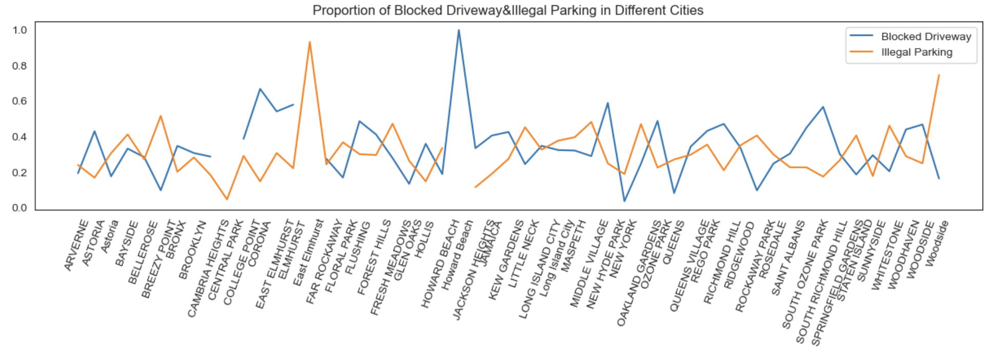
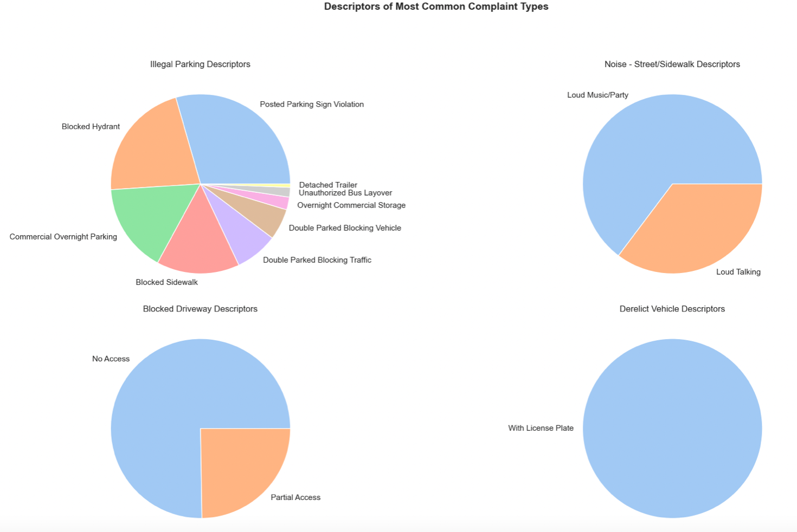

# 美国纽约州2015-2016政务服务热线分析
Here you could see me analyzing NewYork's government call centre data using numpy, pandas, matplotlib and seaborn.
2023/7/14

**一、报告概述**

**分析背景：**

1. 美国纽约州的53个城市在2015-2016年共接收到36w条市民对各类民事违规案件的投诉。

2. 为了提升市民对政委服务的满意度，需通过对2015-2016投诉问题深入分析，针对不同案件类型和地区提出优化建议，以提升人力供需平衡、缩短处理时间和提升案件处理能力。

**数据说明：**

1. 报告使用"美国纽约州2015-2016年政务热线服务数据"作为分析数据源。其中共记录了一年中市民通过政务热线对各类民事违规案件发起的362,177条的投诉。

2. 数据集中记录了美国纽约州的53个城市，23种违规案件类型，包含案件的发生时间、投诉原因等信息。

3. 报告中主要使用了数据集的月份(Month)，投诉类型(Complaint Type)，城市(City)，处理时长(duration),时长水平(Duration\_Level)等主要变量进行分析。

**核心结论：**

1. 5-9月是案件处理复杂度最高的时期，需要增加处理人力，特别是针对Noise - Stree/Sidewalk类型的案件。

2. 布鲁克林、纽约和布朗克斯是案件数量和处理时长较高的地区，需要额外的人力资源。

3. 针对Blocked Driveway和Illegal Parking案件，建议优化处理流程，缩短处理时间，并通过对城市政策和处理流程进行对比分析和调整来减少案件高发城市的发生频率。

4. 在布鲁克林、纽约和布朗克斯这三个案件高发城市，重点关注Blocked Driveway、Illegal Parking和Noise - Stree/Sidewalk等案件类型，并提出相关处理建议，如设置提示标志、优化标示牌等。

**二、思路及数据预处理**

**分析思路：**

1. 根据不同月份案件处理复杂度优化人力分配。
2. 根据不同城市的案件数量&处理总时长优化人力资源调配。
3. 根据高发案件的城市分布分析案件高发原因及优化方法。
4. 分析案件高发城市的案件原因，提升案件处理能力。

**数据预处理：**

1. 数据导入与格式规范：导入数据并将"Created Date","Closed Date"解析为日期格式、将城市数据统一转换为大写。
2. 关键字段提取：根据分析目的剔除非核心数据字段降低运行时间，将数据集从43列减少至19列。
3. 数据处理并加工复合指标：对"Created Date"、"Closed Date"做差，新增"duration"列作为案件处理耗时（单位：小时）。对'Created Date'取月份，新增'Month'列
4. 数据标准化分层：根据duration的分布规律新增Duration\_Level列，将案件处理耗时氛围"长耗时、短耗时、正常耗时"3个梯度。

**三、分析过程及数据可视化**

**1.根据不同月份案件处理复杂度优化人力分配**

某月案件处理复杂度由"当月案件数量"和"案件处理耗时"2个因素共同影响：

*图1-纽约州案件总数随月份变化趋势*

从案件总数变化趋势来看，5月相比4月案件数量有明显增长，月增量约8800。5月案件数量在全年最高，约35800个；5-9月案件数量处于高峰，9月开始有明显下降。

*图2-纽约州不同类型案件数随月份变化趋势*

从不同类型案件数变化趋势可知，Noise - Stree/Sidewalk，Blocked Driveway，Illegal Parking案件数量5月有明显增加。其中Noise - Stree/Sidewalk增势明显，导致5月所有城市的案件总和有大幅上升。

同时Noise - Stree/Sidewalk案件在5-9月持续保持数量较多的水平，导致5-9月案件总数处于高峰；而9月该类案件数有明显下滑，其他案件类型无明显增加，因此9月案件总数开始下降。

*排除耗时异常长和异常短的案件后，大部分案件处理时间分布在1-4.5小时。*

将该范围视为正常处理耗时（Duration\_Level：normal）；处理时长小于1小时视为短耗时案件（Duration\_Level：short）；处理时长在4.5小时以上视为长耗时案件（Duration\_Level：long）。所有案件处理时间中值约为2.2小时。

*图4-不同类型案件在"长耗时"案件中的数量分布*

*图5-纽约州不同处理时长案件占比随月份变化趋势*

由图4可知，在所有"长耗时"案件中，Blocked Driveway，Illegal Parking，Noise - Stree/Sidewalk这3类案件数量最多。导致5月长处理时长的案件占比有增加。

由图5可知，5月长耗时的案件占比增加，短耗时和正常耗时案件占比下降。

"案件数量变化、长耗时案件占比变化"二者趋势吻合，即综合"当月案件数量"和"案件处理耗时"2个因素后，5-9月为全年案件处理复杂度最高的月份。

**小结：人力分配优化**

整体上5-9月案件处理复杂度最高，在这段时间需要增加一定的处理人力；特别在Noise - Stree/Sidewalk类型上需要增补更多人力应对大幅增加的案件数量。而9月后随该类案件数减少可以考虑减少人力。

5-9月Noise - Stree/Sidewalk类型案件激增，考虑为天气因素，建议增加指示牌或适当宣传保证环境噪声适量（后续将进一步结合纽约州天气变化情况进行论证）。

**2.**  **根据不同城市的案件数量&处理总时长优化人力资源调配。**

*图6-不同城市案件数量排名直方图（右图为剔除top6之后剩余城市数据）*

全年中布鲁克林接到的案件数量最多，为118,849，紧接着为纽约和布朗克斯，案件数量分别为77,289和49,166。以上三个城市的案件数量远超与其他城市。

去除案件数量异常值后所有城市的平均案件数量约为1842，约为布鲁克林案件总数的1.5%；中值城市为COLLEGE POINT，案件数量为1397。

*图7-各城市案件总处理时长排名（仅列举top10）*

总处理时长最长的城市依次为为布鲁克林（BROOKLYN），纽约（NEW YORK）以及布鲁克斯（BRONX）。全年中布鲁克林案件处理总时长为468，677小时，布鲁克斯为289，335小时，纽约为225，869小时。

**小结：人力分配优化**

布鲁克林（BROOKLYN），纽约（NEW YORK）以及布鲁克斯（BRONX）全年接到的案件数量远高于其他城市，同时案件处理时长也远高于其他城市，因此需要更多的人力派遣。

下文将对不同案件类型进行深入分析，探究除增加人力外，可提升案件处理能力的方法。另外，案件数量受多种因素影响，如地理面积，人口密度，治安程度，经济发展程度等，未来需对不同城市进行更深入调研分析。

**3.**  **根据高发案件的城市分布分析案件高发原因及优化方法**** 。

*图8-Blocked Driveway，Illegal Parking两种案件在不同城市的数量占比*

Blocked Driveway，Illegal Parking是全年所有城市案件投诉最频繁的两个案件类型。两者在所有案件数量中的占比之和达到约60%。

约70%的Blocked Driveway案件集中在CORONA；但仅有约2%的Blocked Driveway案发生在New York。推测以上两城市在Blocked Driveway案件场景下的相关政策存在较大差异，需重点分析两城市政策差异并优化CORONA的交通政策，以降低交通堵塞发生频率。

约52%的Illegal Parking案件集中在BREEZY POINT；但仅有约3%的Illegal Parking案发生在Central Park。推测以上两城市在Illegal Parking案件场景下的相关政策存在较大差异，需重点分析两城市政策差异并优化BREEZY POINT的车辆停放政策，以降低非法停车案件的发生频率。

*图9-不同类型案件的处理时长中值排名*

数据说明：选取中值是为了避免因案件特殊原因产生过长/短的处理时长对整体排名造成误差影响。

处理时长最长的案件类型为Animal in a Park，超过10小时（因该类案件投诉数量非常少，本次不做特殊分析讨论）；最短的为 Ferry Complaint，不足1小时，Disorderly Youth所需的处理时间处于整体的中值位置，2.2小时。

Blocked Driveway，Illegal Parking两种案件的处理时长中值分别为3.0小时、2.9小时。均高于所有案件处理时间中值2.2小时。除优化这两类案件的高发城市政策外，还需考虑优化案件投诉反馈方式，以减少单个案件的处理耗时。

**小结：高发案件处理优化建议**

由于Blocked Driveway，Illegal Parking频发且平均处理时长较长，建议考虑优化处理流程，缩短以上案件类型的处理时间，节约成本。

建议将以上案件类型发生频率最高和最低的城市进行对比，如Blocked Driveway占比最高的城市为CORONA，约为70%；拥有Blocked Driveway占比最低的城市为New York，约为2%。考虑从城市政策及案件处理流程等方面进行对比分析和政策调整，以减少案件高发城市的发生频率。

同时建议优化政府热线以及网站，将频发的Driveway，Illegal Parking案件相关解决办法放在网页的醒目位置，方便市民自助处理/即使拨打热线反馈。

**4.分析案件高发城市的案件原因，提升案件处理能力。**

由第二部分分析可知，布鲁克林（BROOKLYN），纽约（NEW YORK）以及布鲁克斯（BRONX）全年接到的案件数量、案件处理时长都远高于其他城市，以下将具体分析三个城市的高发案件类型及案件投诉原因。

*图10-布鲁克林，纽约，布朗克斯三城市不同月份高发类型案件数量变化*

布鲁克林，纽约，布朗克斯3个城市全年接到最多的案件类型主要为Blocked Driveway，Illegal Parking和Noise - Stree/Sidewalk，三者全年均处于高数量水平。

*图11-每个案件平均处理时长最长的5个城市，依次分别为Floral Park，Queens Village，Rosedale，Sunnyside, Woodside.*

在这五个城市中最频繁出现的热线类型为Blocked Driveway，Illegal Parking和Derelict Vehicle，以上三个案件类型出现数量远高于其他类型。

*图12-在这五个城市中最频繁出现的案件类型为Blocked Driveway，Illegal Parking和Derelict Vehicle，以上三个案件类型出现数量远高于其他类型*

*图13-Blocked Driveway，Illegal Parking，Noise - Stree/Sidewalk和Derelict Vehicle案件报案原因分布*

Blocked Driveway原因标签大部分为No Access(75%),小部分为Loud Talking(25%)。

Illegal Parking主要原因标签为：Posted Walking Sign Violation（约30%），Blocked Hydrant(20%)，Commercial Overnight Parking(17%) 和 Blocked Sidewalk(15%)。

Noise - Stree/Sidewalk原因标签大部分为Loud Music/Party(63%),小部分为Loud Talking(37%)。

Derelict Vehicle原因标签全部为With License PLate。

**小结： 案件处理方式建议**

在布鲁克林，纽约，布朗克斯3个案件高发城市，从案件数量，增长程度，频发程度，平均处理时长上看，需要重点关注的案件类型有Blocked Driveway，Illegal Parking，Noise - Stree/Sidewalk。

通过对案件类型的原因标签进行分析，得出高发案件的处理建议如下：

1. Blocked Driveway主要因No Access而发生，建议在非公众场所/路段通过多种方式设置提示。

2. Illegal Parking的主要原因是Posted Walking Sign Violation，可以考虑将标示牌优化，使其更加醒目。

3. Noise - Stree/Sidewalk的主要原因为Loud Music/Party(63%)，建议在案件高发街道设置"保持安静"等相关的提示标志。

**四、总结与建议**

案件处理复杂度在5-9月期间最高，特别是对于Noise - Stree/Sidewalk类型案件，需在5-9月增补更多人力应对激增的案件数量。而随着9月后该类案件数减少，可以考虑适度减少人力投入。

布鲁克林（BROOKLYN）、纽约（NEW YORK）以及布鲁克斯（BRONX）是案件数量和处理时长较高的城市，因此需要派遣更多人力资源。

由于Blocked Driveway和Illegal Parking案件频发且处理时长较长，建议优化处理流程，缩短处理时间，以节约成本。将发生频率最高和最低的城市进行对比，考虑从城市政策和案件处理流程等方面进行对比分析和政策调整，以减少案件高发城市的发生频率。同时，建议优化政府热线和网站，将Driveway和Illegal Parking案件的解决办法放在网页的醒目位置，方便市民自助处理或拨打热线反馈。

在布鲁克林、纽约和布朗克斯这三个案件高发城市，需要重点关注Blocked Driveway、Illegal Parking和Noise - Stree/Sidewalk等案件类型。通过对案件类型的原因标签进行分析，得出以下高发案件的处理建议：

1. Blocked Driveway主要因No Access而发生，建议在非公众场所/路段通过多种方式设置提示。

2. Illegal Parking的主要原因是Posted Walking Sign Violation，可以考虑优化标示牌，使其更加醒目。

3. Noise - Stree/Sidewalk的主要原因是Loud Music/Party（占比63%），建议在高发街道设置提示标志，引导市民保持安静。

**五、附录**

file:///Users/tingyuwang/Downloads/北美报案分析-Copy1.html
