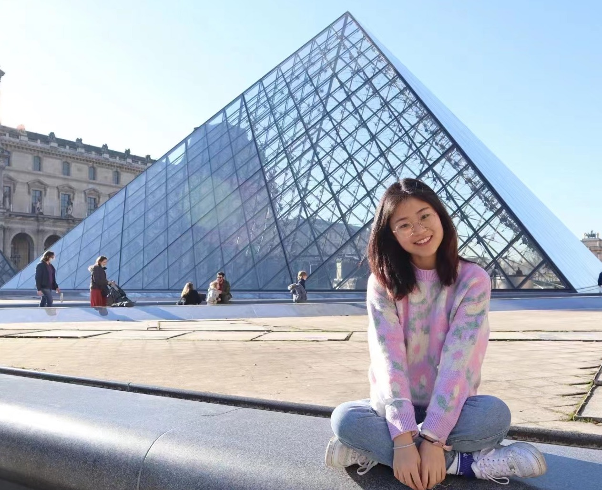

🌻 Hi, I’m Tingyu 🌻
==============

I started putting my hands on coding and data analysis in 2022, when I graduated from KU Leuven with the master's degree of Arts. Before that I earned my bachelor's degree in Italian and English languages.  

I love what I have learned during the years in university and I am happy that with more and more powerful computer technology, language and algorithm come into the phase of Large Language Model, which is gradually taking up people's Life(horrible AI!). I bet to say that I love exploring brand new field and I am a fan of learning languages, which undoubtedly includes the coding languages. In this way, I began my journey with Python and MySQL, realizing my ideas by web development and playing with data.  

I love the feeling when creating the blueprint for a project and when writing the exact codes, which is similar to building a castle: firstly, I need to know what I really want it to be, and then brick by brick the castle is showing up.

Experiences
-----------

### Working experiences 💻

Currently I am working for **ByteDance** doing **LLM evaluation**. My primary work involves linguistically categorizing content generated by AI models and build and modify the prompts and question bank for model training. During the work, I came to realize the importance of mastering a programming language, no matter R, Python or even SQL. Sooo, (al)ready (to) get my hands dirt(ier)!

Previously I worked for **Amazon** as a **selling partner support associate**; I have learned how to use Excel making visual data report and evaluate the metrics to optimize performance.  

I got some experiences as intern in **language teaching and administrative support** both in Belgium and China. From this I obtained the practical skills like Social Media Operation, Activity design and project management; additionally I attained the soft skills such as communicating effectively and time management.

### Academic life 📚

I was awarded the **Master's degree in Cultural Studies** by KU Leuven in 2022, there in Belgium I studied cultural theories and policies and completed an internship in a cultural heritage institution.  

I finished my **Bachelor's study in Italian and English language and literature** at Nanjing Normal University in China for 5 years, during which I spent a year living at **Ca'Foscari in Venice, Italy**, as an exchange student to further my italian study in linguistic and cultural dimensions.  

### Technical skills 🥷🏼

**Data analysis**  
👉 Python, Numpy, Pandas, Matplotlib, Seaborn  
👉 MySQL, Excel, PowerBI  

**Web Development**  
👉 Python, HTML, CSS, JS  
👉 Flask, Node.js

### Language skills 👅

👉 Chinese: mandarin
👉 English&Italian: fluent
👉 French: I am trying...

### Hobbies 🏊🏼‍♀️

**I like**  
💓 Singing, reading and watching films.(the average amount of each per year is about 50). I am also trying drum kit❤️
💓 Traveling around with only a backpack; I have visited more than 12 countries and 35 cities by my own.  
💓 Swimming and jogging; for me, doing sports is another way of meditation.  
💓 Playing with data and codes, through which I make conversations with both computers and users.
